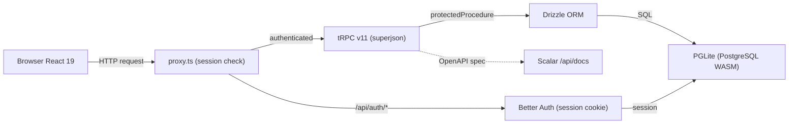
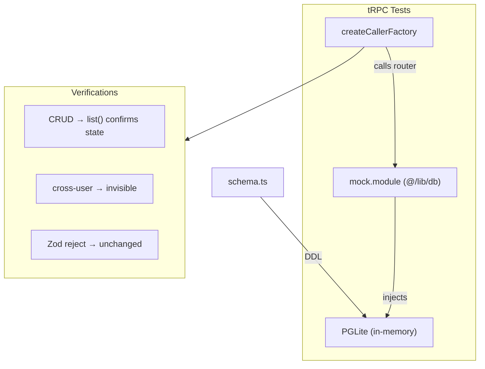
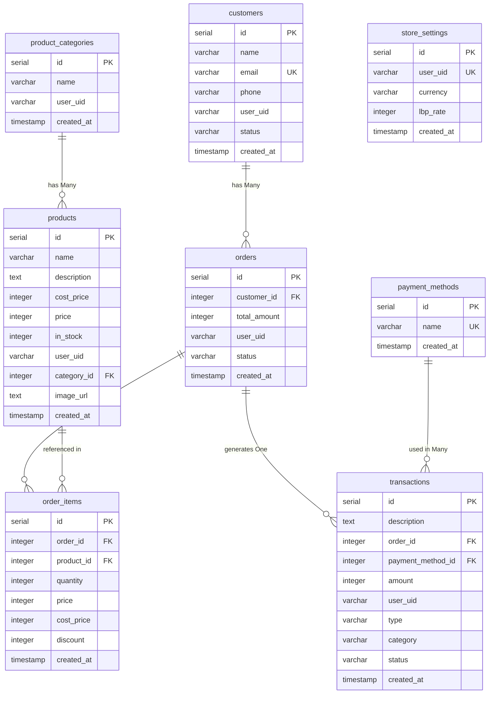

# FinOpenPOS

Open-source Point of Sale (POS) and inventory management system with **Arabic localization and RTL support**. Built with Next.js 16, React 19 and embedded PostgreSQL via PGLite. Turborepo monorepo designed for speed and simplicity. Zero external dependencies to run — `bun install && bun run dev` and you're set.

## Table of Contents

- [Features](#features)
- [Architecture](#architecture)
- [Tech Stack](#tech-stack)
- [Quick Start](#quick-start)
- [Scripts](#scripts)
- [Project Structure](#project-structure)
- [API](#api)
  - [Interactive Docs](#interactive-docs)
  - [tRPC Procedures](#trpc-procedures)
- [Testing](#testing)
- [Docker Deploy](#docker-deploy)
- [Database](#database)
  - [Schema](#schema)
  - [PGLite (default)](#pglite-default)
  - [Migrating to PostgreSQL](#migrating-to-postgresql)
- [Contributing](#contributing)
- [License](#license)

## Features

### Business
- **Dashboard** with interactive charts (revenue, expenses, cash flow, profit margin)
- **Multi-Category Management** with dedicated CRUD UI
- **Product Management** with relational categories, cost tracking, and stock control
- **Customer Management** with active/inactive status and purchase history
- **Order Management** with items, totals, and per-item discounts
- **Point of Sale (POS)** optimized for touch with product search and category filtering
- **Cashier** with income and expense transaction logging
- **Multi-Currency Support** with customizable LBP exchange rates
- **Authentication** with email/password via Better Auth
- **API Documentation** auto-generated interactive docs via Scalar at `/api/docs`

### Localization
- **Full Arabic Support** — complete translation of all UI strings and business logic
- **Native RTL Layout** — automatic Right-to-Left structuring for a seamless Arabic experience
- **Multi-Language Engine** — easily extendable to other languages via `next-intl`

## Architecture



## Tech Stack

| Layer | Technology |
|-------|------------|
| Framework | Next.js 16 (App Router) |
| UI | React 19, Tailwind CSS 4, Radix UI, Recharts |
| Database | PGLite (PostgreSQL via WASM) |
| ORM | Drizzle ORM |
| API | tRPC v11 (end-to-end type safety) |
| Auth | Better Auth |
| API Docs | Scalar (OpenAPI 3.0) |
| Runtime | Bun |
| i18n | next-intl (en + ar) |
| Monorepo | Turborepo, Biome |

## Quick Start

```bash
git clone https://github.com/JoaoHenriqueBarbosa/FinOpenPOS.git
cd FinOpenPOS
cp apps/web/.env.example apps/web/.env
```

Edit `apps/web/.env` with a secure secret:

```
BETTER_AUTH_SECRET=generate-with-openssl-rand-base64-32
BETTER_AUTH_URL=http://localhost:3001
```

```bash
bun install
bun run dev
```

Open http://localhost:3001 and use the **Fill demo credentials** button to sign in with the test account (`test@example.com` / `test1234`).

> The first `bun run dev` automatically creates the database at `apps/web/data/pglite`, pushes the schema via Drizzle and runs the seed with demo data (20 customers, 32 products, 40 orders, 25 transactions).

## Scripts

| Command | Description |
|---------|-------------|
| `bun run dev` | Start all apps via Turborepo |
| `bun run dev:web` | Start only the web app |
| `bun run check` | Lint and format with Biome |
| `cd apps/web && bun test` | Run tRPC router tests |
| `cd apps/web && bun run prepare-prod` | Migrate from PGLite to real PostgreSQL |

## Project Structure

```
FinOpenPOS/
├── apps/
│   └── web/                    # Next.js 16 web application
│       ├── src/
│       │   ├── app/            # Pages (admin, login, signup, API routes)
│       │   ├── components/     # UI components (shadcn + custom)
│       │   ├── lib/
│       │   │   ├── db/         # Drizzle schema + PGLite singleton
│       │   │   └── trpc/       # tRPC routers
│       │   ├── messages/       # i18n (en.ts, ar.ts)
│       │   └── proxy.ts        # Next.js 16 middleware
│       ├── scripts/            # DB ensure, ER gen, prepare-prod, migrations
│       └── data/               # PGLite database (gitignored)
├── packages/
│   └── ui/                     # Shared UI components
├── turbo.json                  # Turborepo task config
├── biome.json                  # Linter/formatter config
├── Dockerfile                  # Dev (PGLite) Docker image
└── Dockerfile.production       # Production (PostgreSQL) Docker image
```

## API

All API procedures require authentication via Better Auth session cookie. The API uses **tRPC** for end-to-end type safety — frontend components consume procedures directly with full TypeScript inference.

### Interactive Docs

Visit **`/api/docs`** for the full interactive API reference powered by Scalar, auto-generated from the tRPC router definitions.

The raw OpenAPI 3.0 spec is available at `/api/openapi.json`.

### tRPC Procedures

| Router | Procedures | Description |
|--------|-----------|-------------|
| `products` | `list`, `create`, `update`, `delete` | Product CRUD with stock and categories |
| `categories` | `list`, `create`, `update`, `delete` | Product Category CRUD |
| `customers` | `list`, `create`, `update`, `delete`, `get` | Customer CRUD and profile details |
| `orders` | `list`, `create`, `update`, `delete`, `get` | Order management and receipt details |
| `transactions` | `list`, `create`, `update`, `delete` | Income/expense transaction logging |
| `paymentMethods` | `list`, `create`, `update`, `delete` | Payment method management |
| `dashboard` | `stats` | Aggregated revenue, expenses, profit, cash flow, margins |
| `settings` | `getStoreSettings`, `updateStoreSettings` | Store currency and exchange rate config |

## Testing

The project includes comprehensive test suites for the API layer and database procedures.

```bash
# Run all tests
bun run test

# tRPC router tests only
cd apps/web && bun test
```



## Docker Deploy

The project includes a multi-stage Alpine-based Dockerfile and Docker Compose with a persistent volume.

```bash
docker compose up -d          # Build and start
docker compose logs -f        # View logs
docker compose down           # Stop
```

> **Note**: For Docker, set `BETTER_AUTH_SECRET` and `BETTER_AUTH_URL` in your `.env` file.

## Database

### Schema

<!-- ER_START -->



<!-- ER_END -->

All monetary values are stored as **integer cents** to avoid floating-point precision issues. All tables with `user_uid` enforce multi-tenancy.

### PGLite (default)

PGLite runs full PostgreSQL via WASM, directly in the Node.js process. Data is stored at `apps/web/data/pglite`.

### Migrating to PostgreSQL

Run the built-in script to migrate to a standalone PostgreSQL:

```bash
cd apps/web && bun run prepare-prod
```

## Contributing

Contributions are welcome! Please open an issue or submit a Pull Request.

## License

MIT License — see [LICENSE](LICENSE).
